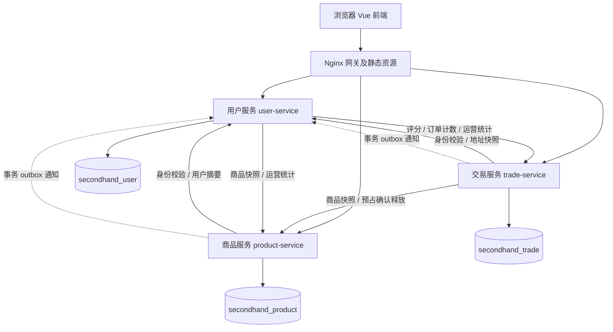

# 完整微服务改造与交付说明

## 1. 实现状态

原方案104个公开接口已全部迁移到三个独立业务服务（user 28、product 25、trade 51）。三者可分别构建、测试和制作镜像；公共platform不包含业务实体或业务Repository。旧backend保留作版本对照，不在微服务运行链路中。

本轮最终后端115项、前端25项测试全部通过，无失败/错误/跳过。七类原业务场景（注册登录、商品管理、购买、发货、议价、售后、举报）全部纳入真实HTTP端到端回归；另补充地址/消息/上传/后台/支付/评价及可靠性边界。测试报告按每个JUnit用例列出操作、实测状态码、断言和源码位置。

## 2. 服务划分图

按业务数据与事务边界拆分：用户服务负责身份及社交消息；商品服务独占商品与库存；交易服务拥有完整订单、支付、物流、售后生命周期。网关、前端和数据库均不计入三个业务服务。

## 3. 业务表归属

| 表 | 唯一管理服务 | 数据库 | 职责 |
|---|---|---|---|
| users | user-service | secondhand_user | 账号、角色、状态、昵称及联系方式 |
| user_identities | user-service | secondhand_user | 手机号/邮箱等登录标识及用户关联 |
| user_addresses | user-service | secondhand_user | 用户地址及默认地址 |
| chat_messages | user-service | secondhand_user | 商品相关私聊及已读状态 |
| products | product-service | secondhand_product | 商品描述、卖家、价格、可售数量及上下架状态 |
| product_images | product-service | secondhand_product | 商品图片、排序和缩略图 |
| categories | product-service | secondhand_product | 商品分类及层级 |
| favorites | product-service | secondhand_product | 用户收藏商品的关系 |
| comments | product-service | secondhand_product | 商品评论及作者 |
| reports | product-service | secondhand_product | 商品举报、处理状态、处理人和备注 |
| offers | trade-service | secondhand_trade | 报价金额、买卖双方、接受状态及关联订单 |
| orders | trade-service | secondhand_trade | 订单金额、买卖双方、履约状态及地址快照 |
| order_events | trade-service | secondhand_trade | 订单状态变化及业务事件历史 |
| shipments | trade-service | secondhand_trade | 发货运单、承运人和物流状态 |
| after_sale_requests | trade-service | secondhand_trade | 退款退货、举证、仲裁及运费责任 |
| ratings | trade-service | secondhand_trade | 订单评价、评价人、卖家及分数 |

新增技术/业务表也按域隔离：用户库`user_security_state`、`notifications`；商品库`inventory_reservations`、`outbox_events`；交易库`trade_operations`、`outbox_events`、`payments`、`refunds`；每个库各自有`schema_history`。同名outbox属于各自数据库，不共享表。

其他服务不能直接读写这些表；已使用真实DML账号对六种跨库方向分别验证SELECT、INSERT、UPDATE、DELETE都被拒绝（一个JUnit方法内24项权限断言）。允许同域订单与售后联表；不允许跨服务联表。测试夹具的管理员账号仅创建临时库，实际服务连接仍使用最小DML权限。

## 4. 104个公开服务接口

下表是当前已实现清单。API路径与原前端兼容，订单创建新增幂等键；前端已自动生成并在网络失败/处理中保留同键。`CREATING`返回202表示结果仍在恢复中，不能当作失败重新创建一笔订单。

| 编号 | 服务 | HTTP | 路径 | 用途 | 权限约束 |
|---|---|---|---|---|---|
| API-001 | user-service | DELETE | `/api/users/addresses/{id}` | 删除收货地址 | 本人登录；校验资源归属 |
| API-002 | user-service | GET | `/api/users/addresses` | 我的收货地址 | 本人登录；校验资源归属 |
| API-003 | user-service | POST | `/api/users/addresses` | 新增收货地址 | 本人登录；校验资源归属 |
| API-004 | user-service | PUT | `/api/users/addresses/{id}` | 修改收货地址 | 本人登录；校验资源归属 |
| API-005 | user-service | PUT | `/api/users/addresses/{id}/default` | 设置默认地址 | 本人登录；校验资源归属 |
| API-006 | user-service | GET | `/api/admin/dashboard` | 汇总用户商品交易统计 | ADMIN；高风险操作审计 |
| API-007 | user-service | GET | `/api/admin/users` | 管理端用户分页查询 | ADMIN；高风险操作审计 |
| API-008 | user-service | GET | `/api/admin/users/online` | 查询在线用户 | ADMIN；高风险操作审计 |
| API-009 | user-service | GET | `/api/admin/users/{id}` | 管理端用户详情 | ADMIN；高风险操作审计 |
| API-010 | user-service | POST | `/api/admin/users/{id}/kick` | 强制用户下线 | ADMIN；高风险操作审计 |
| API-011 | user-service | PUT | `/api/admin/users/{id}/disable` | 启用或禁用账号 | ADMIN；高风险操作审计 |
| API-012 | user-service | GET | `/api/auth/me` | 当前登录用户信息 | 本人登录 |
| API-013 | user-service | POST | `/api/auth/heartbeat` | 更新在线心跳 | 本人登录 |
| API-014 | user-service | POST | `/api/auth/login` | 登录并签发令牌 | 匿名；限流 |
| API-015 | user-service | POST | `/api/auth/password/change` | 修改登录密码 | 本人登录 |
| API-016 | user-service | POST | `/api/auth/register` | 用户注册 | 匿名；限流 |
| API-017 | user-service | GET | `/api/products/{productId}/chat` | 读取双方对话 | 登录且为会话参与者；不信任请求中的发件人 |
| API-018 | user-service | GET | `/api/users/messages` | 我的会话摘要 | 登录且为会话参与者；不信任请求中的发件人 |
| API-019 | user-service | POST | `/api/products/{productId}/chat` | 发送商品相关私聊 | 登录且为会话参与者；不信任请求中的发件人 |
| API-020 | user-service | PUT | `/api/messages/read` | 标记指定会话已读 | 登录且为会话参与者；不信任请求中的发件人 |
| API-021 | user-service | GET | `/api/messages/comments` | 商品评论通知 | 本人登录；校验资源归属 |
| API-022 | user-service | GET | `/api/messages/system` | 订单和举报系统通知 | 本人登录；校验资源归属 |
| API-023 | user-service | GET | `/api/regions` | 省市区静态数据 | 匿名可读 |
| API-024 | user-service | GET | `/api/users/notifications` | 未读消息及待办数量 | 本人登录 |
| API-025 | user-service | GET | `/api/users/profile` | 我的个人资料 | 本人登录 |
| API-026 | user-service | GET | `/api/users/{id}/public` | 卖家公开资料和评分摘要 | 匿名可读 |
| API-027 | user-service | PUT | `/api/users/avatar` | 上传头像 | 本人登录 |
| API-028 | user-service | PUT | `/api/users/profile` | 修改个人资料 | 本人登录 |
| API-029 | product-service | DELETE | `/api/admin/products/{id}` | 管理端删除违规商品 | ADMIN；高风险操作审计 |
| API-030 | product-service | GET | `/api/admin/products` | 管理端商品检索 | ADMIN；高风险操作审计 |
| API-031 | product-service | PUT | `/api/admin/products/{id}/off-shelf` | 管理端强制下架 | ADMIN；高风险操作审计 |
| API-032 | product-service | PUT | `/api/admin/products/{id}/on-shelf` | 管理端重新上架 | ADMIN；高风险操作审计 |
| API-033 | product-service | GET | `/api/admin/reports` | 管理端举报列表 | ADMIN；高风险操作审计 |
| API-034 | product-service | PUT | `/api/admin/reports/{id}/dismiss` | 驳回举报 | ADMIN；高风险操作审计 |
| API-035 | product-service | PUT | `/api/admin/reports/{id}/handle` | 办结举报 | ADMIN；高风险操作审计 |
| API-036 | product-service | GET | `/api/categories` | 商品分类树 | 匿名可读 |
| API-037 | product-service | GET | `/api/products/{productId}/comments` | 商品评论列表 | 匿名可读 |
| API-038 | product-service | POST | `/api/products/{productId}/comments` | 发表评论 | 登录用户 |
| API-039 | product-service | DELETE | `/api/products/{productId}/favorite` | 取消收藏 | 本人登录；校验资源归属 |
| API-040 | product-service | GET | `/api/products/{productId}/favorite/status` | 我的收藏状态 | 本人登录；校验资源归属 |
| API-041 | product-service | GET | `/api/users/favorites` | 我的收藏列表 | 本人登录；校验资源归属 |
| API-042 | product-service | POST | `/api/products/{productId}/favorite` | 收藏商品 | 本人登录；校验资源归属 |
| API-043 | product-service | GET | `/api/my-products` | 我的商品列表 | 本人登录；校验资源归属 |
| API-044 | product-service | GET | `/api/products` | 商品分页分类搜索推荐 | 匿名可读 |
| API-045 | product-service | GET | `/api/products/{id}` | 商品详情 | 匿名可读 |
| API-046 | product-service | POST | `/api/products` | 发布商品 | 登录；写操作校验卖家本人 |
| API-047 | product-service | PUT | `/api/products/{id}` | 编辑商品或上下架 | 登录；写操作校验卖家本人 |
| API-048 | product-service | DELETE | `/api/products/{productId}/images/{imageId}` | 删除商品图片 | 商品卖家；图片须属于该商品 |
| API-049 | product-service | GET | `/api/products/{productId}/images` | 商品图片列表 | 登录可读 |
| API-050 | product-service | POST | `/api/products/{productId}/images` | 上传商品图片 | 商品卖家；图片须属于该商品 |
| API-051 | product-service | PUT | `/api/products/{productId}/images/{imageId}/cover` | 设置商品封面 | 商品卖家；图片须属于该商品 |
| API-052 | product-service | POST | `/api/products/{productId}/report` | 举报商品 | 本人登录；校验资源归属 |
| API-053 | product-service | GET | `/api/users/{sellerId}/products` | 卖家在售商品 | 匿名可读 |
| API-054 | trade-service | GET | `/api/admin/after-sale` | 管理端售后分页筛选 | ADMIN；高风险操作审计 |
| API-055 | trade-service | GET | `/api/admin/after-sale/{id}` | 管理端售后详情 | ADMIN；高风险操作审计 |
| API-056 | trade-service | POST | `/api/admin/after-sale/process-timeouts` | 管理员触发售后超时处理 | ADMIN；高风险操作审计 |
| API-057 | trade-service | POST | `/api/admin/after-sale/{id}/arbitrate` | 责任运费及退款仲裁 | ADMIN；高风险操作审计 |
| API-058 | trade-service | GET | `/api/admin/orders` | 管理端订单分页 | ADMIN；高风险操作审计 |
| API-059 | trade-service | GET | `/api/admin/orders/{id}` | 管理端订单详情 | ADMIN；高风险操作审计 |
| API-060 | trade-service | POST | `/api/admin/orders/{id}/cancel` | 管理员取消订单 | ADMIN；高风险操作审计 |
| API-061 | trade-service | POST | `/api/admin/orders/{id}/mark-paid` | 管理员标记已支付 | ADMIN；高风险操作审计 |
| API-062 | trade-service | GET | `/api/after-sale/all` | 旧版管理员售后列表 | ADMIN；作业入口另行隔离 |
| API-063 | trade-service | GET | `/api/after-sale/by-order/{orderId}` | 订单售后记录 | 对应买卖双方或 ADMIN |
| API-064 | trade-service | GET | `/api/after-sale/my-received` | 我收到的售后 | 对应订单卖家 |
| API-065 | trade-service | GET | `/api/after-sale/my-requests` | 我申请的售后 | 对应订单买家 |
| API-066 | trade-service | GET | `/api/after-sale/{id}` | 售后单详情 | 对应买卖双方或 ADMIN |
| API-067 | trade-service | POST | `/api/after-sale` | 买家发起售后 | 对应订单买家 |
| API-068 | trade-service | POST | `/api/after-sale/process-timeouts` | 触发售后超时处理 | ADMIN；作业入口另行隔离 |
| API-069 | trade-service | POST | `/api/after-sale/{id}/approve` | 卖家同意售后 | 对应订单卖家 |
| API-070 | trade-service | POST | `/api/after-sale/{id}/arbitrate` | 旧版平台仲裁入口 | ADMIN；作业入口另行隔离 |
| API-071 | trade-service | POST | `/api/after-sale/{id}/buyer-evidence` | 买家补充举证 | 对应订单买家 |
| API-072 | trade-service | POST | `/api/after-sale/{id}/cancel` | 买家取消售后 | 对应订单买家 |
| API-073 | trade-service | POST | `/api/after-sale/{id}/confirm-return` | 卖家确认收到退货 | 对应订单卖家 |
| API-074 | trade-service | POST | `/api/after-sale/{id}/escalate` | 买家申请平台介入 | 对应订单买家 |
| API-075 | trade-service | POST | `/api/after-sale/{id}/reject` | 卖家拒绝售后 | 对应订单卖家 |
| API-076 | trade-service | POST | `/api/after-sale/{id}/reject-return` | 卖家拒收退货 | 对应订单卖家 |
| API-077 | trade-service | POST | `/api/after-sale/{id}/return-ship` | 买家填写退货运单 | 对应订单买家 |
| API-078 | trade-service | POST | `/api/after-sale/{id}/seller-evidence` | 卖家提交举证 | 对应订单卖家 |
| API-079 | trade-service | GET | `/api/shipments/{orderId}/track` | 查询订单物流轨迹 | 订单买卖双方或 ADMIN（拟收紧） |
| API-080 | trade-service | GET | `/api/my-offers` | 我发出的报价 | 报价买家本人 |
| API-081 | trade-service | GET | `/api/products/{productId}/offers` | 卖家查看商品报价 | 商品/报价卖家 |
| API-082 | trade-service | GET | `/api/seller-offers` | 我收到的报价 | 商品/报价卖家 |
| API-083 | trade-service | POST | `/api/offers/{id}/accept` | 接受报价并创建订单 | 商品/报价卖家 |
| API-084 | trade-service | POST | `/api/offers/{id}/cancel` | 撤回报价 | 报价买家本人 |
| API-085 | trade-service | POST | `/api/offers/{id}/reject` | 拒绝报价 | 商品/报价卖家 |
| API-086 | trade-service | POST | `/api/products/{productId}/offers` | 发起议价 | 报价买家本人 |
| API-087 | trade-service | GET | `/api/orders/bought` | 我买到的订单 | 当前买家；已有订单须本人所有 |
| API-088 | trade-service | GET | `/api/orders/sold` | 我卖出的订单 | 当前卖家本人 |
| API-089 | trade-service | GET | `/api/orders/{id}` | 订单详情及可用操作 | 订单买卖双方或 ADMIN |
| API-090 | trade-service | POST | `/api/orders` | 按商品原价创建订单 | 当前买家；已有订单须本人所有 |
| API-091 | trade-service | POST | `/api/orders/process-settlements` | 触发到期结算 | ADMIN；定时作业另用内部身份 |
| API-092 | trade-service | POST | `/api/orders/{id}/cancel` | 买家取消订单 | 当前买家；已有订单须本人所有 |
| API-093 | trade-service | POST | `/api/orders/{id}/confirm` | 买家确认收货 | 当前买家；已有订单须本人所有 |
| API-094 | trade-service | POST | `/api/orders/{id}/mark-paid` | 旧版支付兼容入口 | 当前买家；已有订单须本人所有 |
| API-095 | trade-service | POST | `/api/orders/{id}/pay` | 支付订单 | 当前买家；已有订单须本人所有 |
| API-096 | trade-service | POST | `/api/orders/{id}/ship` | 卖家发货 | 订单卖家 |
| API-097 | trade-service | PUT | `/api/orders/{id}/receiver` | 补填或更新收货信息 | 当前买家；已有订单须本人所有 |
| API-098 | trade-service | GET | `/api/payments/{paymentNo}` | 查询支付状态 | 支付单所属买家或授权管理员 |
| API-099 | trade-service | POST | `/api/payments` | 创建模拟支付单 | 支付单所属买家或授权管理员 |
| API-100 | trade-service | POST | `/api/payments/{paymentNo}/mock-pay` | 开发测试模拟支付成功 | 支付单所属买家；mock 仅开发/测试 |
| API-101 | trade-service | GET | `/api/orders/{orderId}/rating` | 查询订单评价 | 订单买卖双方或 ADMIN |
| API-102 | trade-service | GET | `/api/users/{userId}/rating` | 卖家评分摘要 | 匿名可读 |
| API-103 | trade-service | POST | `/api/orders/{orderId}/rate` | 对已完成交易评分 | 订单买家 |
| API-104 | trade-service | GET | `/api/users/{sellerId}/sold` | 卖家已售订单及评价 | 匿名可读 |

## 5. 跨服务接口与一致性

| 调用方→提供方 | 接口/用途 | 失败处理 |
|---|---|---|
| 商品/交易→用户 | POST `/internal/v1/auth/introspect`，POST `/internal/v1/users/batch` | 无有效凭证不放行；下游不可用返回503，不信任请求自带身份 |
| 交易→用户 | POST `/internal/v1/addresses/resolve` | 校验地址属于买家，保存下单时快照；失败时不产生库存写入 |
| 用户/交易→商品 | GET `/internal/v1/products/{id}` | 由商品服务读取自身库；不存在/下架/无库存按业务错误返回 |
| 交易→商品 | POST `/internal/v1/inventory/reservations`、`/{operationId}/confirm`、`/{operationId}/release` | 固定order-create业务键、请求内容指纹、库存行锁；未知结果保留恢复任务 |
| 商品→交易 | GET `/internal/v1/orders/{id}/inventory-state` | 提供交易侧状态核对，不读取交易库 |
| 用户→交易 | `/internal/v1/ratings/{sellerId}`、`/internal/v1/users/{userId}/trade-counts`、`/internal/v1/trade/stats` | 评分/通知计数/后台聚合经HTTP，不跨库联表 |
| 用户/交易→商品 | GET `/internal/v1/products/stats` | 商品侧聚合统计，失败不会伪造成功结果 |
| 商品/交易→用户 | POST `/internal/v1/notifications` | 事务内写outbox，租约抢占、指数退避、按来源+事件号去重；多次失败记录日志 |

内部JWT校验签名、签发服务、目标服务、kind、有效期，控制器再次检查允许调用方。网关不转发`/internal/`。服务之间只交换DTO及标识，不共享数据库连接、实体或Repository。

订单创建：读取商品/地址→交易库写CREATING及RESERVE_PENDING→商品库幂等预占→交易库WAIT_PAY→确认库存。取消先写订单终态及RELEASE_PENDING再补偿库存，晚到的预占会被释放墓碑拒绝。恢复任务有持久化状态、30秒租约及退避；不会依赖原JVM内存。议价接受使用offer-accept固定键，重复请求返回同一订单。

商品/交易的通知在本域业务事务中与outbox一起提交，投递成功才标记published_at。用户库使用“已验签来源:eventId”唯一键接收。专项测试模拟接收已落库但网络响应丢失，并重新创建发送器：通知始终只有一条。

模拟支付与退款记录已由内存改为交易库账本；支付绑定订单和买家，退款绑定售后且不超过剩余可退金额。真实支付渠道未接入，生产默认关闭模拟付款，不能把模拟账本当成真实资金结算。

## 6. 本地实际验收

| 检查项 | 结果与证据 |
|---|---|
| 后端完整回归 | 115/115；原始 Failsafe XML 可由 `mvn -B clean verify` 重新生成 |
| 前端测试/构建 | 25/25；`reports/frontend-junit.xml`；Vite生产构建通过 |
| 公开接口 | 104/104成功HTTP记录，并核验所属服务路由 |
| 独立镜像构建 | user、product、trade 和 gateway 四个镜像构建完成；可由部署脚本重新验证 |
| 本地实际部署 | 固定版本`phase2-20260828`，三服务readiness及版本检查通过 |
| 网关业务回归 | 购买付款发货收货评价、议价取消、退货退款三条流程；`reports/local-runtime/smoke.json` |
| 故障定位 | failure-drill网关启动因intentional_invalid_directive失败，日志定位到配置第1行 |
| 实际回滚 | 恢复 phase2-20260828、重新跑三流程并核验旧商品/库存未丢失；可重新执行回滚演练生成结果 |
| 数据库迁移 | 用户3版、商品2版、交易4版；重复运行跳过已执行版本，校验和忽略CR换行差异 |
| Kubernetes/Shell | kubectl清单结构校验及bash语法检查通过；未在集群实际发布 |

本地失败修复记录：初始化Shell的CRLF导致`bash\r`不存在；统一LF后完成初始化。PowerShell5.1中文脚本解码和Docker stderr误判分别通过UTF-8 BOM、按原生退出码判断修复。冒烟测试曾误写收货接口为confirm-receipt，已按实际契约修正为confirm。上述开发轮失败不混入最终通过次数。

## 7. CI/CD和交付边界

完整流水线已写入`.github/workflows/microservices-ci.yml`，测试失败会阻断镜像发布和部署，XML/HTTP/前端报告仍归档。Kubernetes提供独立命名空间、持久卷、三服务及网关Deployment/Service、健康探针、网络策略、增量迁移Job、日志采集与回滚脚本。

按要求未提交Git、未推送远端、未发布GHCR镜像，因此不存在“本轮远端流水线已经成功”的证据。远端自动部署需要按部署指南配置受保护环境与集群凭证。生产TLS、备份、监控告警接收端、容量/安全审计和真实支付物流渠道应在具体环境中另行验收。

原始单体数据未被修改。现网历史数据导入需要明确源库与停机切换方案，不能把已有订单仅复制一张表后直接切换库存状态机；详见部署指南。

改造前由标签`monolith-before-microservices`及Git归档保存；改造后由当前本地工作树和交付包中的完整源码快照保存。交付文件集中在`交付材料/微服务完整改造/`，包内包含Dockerfile、流水线、Kubernetes、SQL、部署回滚脚本和原始报告，不含.env、私钥、node_modules或容器数据。
