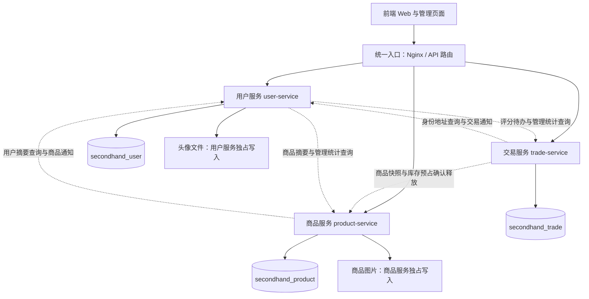
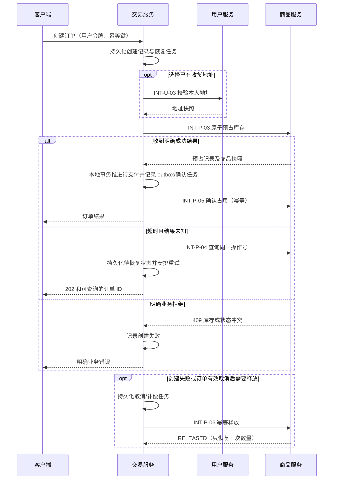

# 微服务划分图与说明

> 方案日期：2026-08-28。现状基线：`fa88c48f5481a8d551fa8b2b336148fcf943ad56`。
> **这是设计方案，不是已完成的微服务改造成果。** 当前项目仍由一个 Spring Boot 后端访问一套业务数据库。本次不移动业务代码、不执行数据库变更、不修改流水线或部署。

## 1. 划分依据

按照“用户身份及交互、商品内容与可售库存、交易履约”三个业务范围划分，不按 Controller 数量或用例数量机械拆分。每个业务服务拥有自己的数据、启动入口、构建产物、测试和发布单元。

用户服务包含注册登录之外的资料、地址、聊天和收件箱，是业务服务，不是仅承担路由或令牌转发的技术组件。前端、网关、MySQL、可选缓存等均不计入三个业务服务。

| 服务 | 业务职责 | 不负责的业务 | 现有业务表数 | 现有公开 API 数 |
|---|---|---|---:|---:|
| `user-service` 用户服务 | 注册登录、资料与地址、账号管理、私聊、通知收件箱；保留只读聚合适配器 | 不拥有商品、库存、订单、评价或举报事实数据 | 4 | 28 |
| `product-service` 商品服务 | 商品、分类与图片、可售库存、评论收藏、商品举报与审核 | 不管理订单、付款、售后或用户账号 | 6 | 25 |
| `trade-service` 交易服务 | 议价、订单、支付适配、发货物流、收货结算、售后仲裁、交易评价 | 不直接修改商品表、用户表或地址表 | 6 | 51 |
| 合计 | 三个业务服务 | 网关/数据库不计数 | **16** | **104** |

上述表数只统计 `db/init.sql` 及 Entity 中现有业务表；库存预占、通知投影、outbox 等拟新增表另列于数据方案。

## 2. 目标服务划分图



实线表示入口路由或本服务直接管理的数据；虚线表示通过受保护内部 API 发生的服务间调用。三个数据库可以在同一台 MySQL 上，但必须使用不同数据库和不同运行账号，图中没有跨服务数据库访问箭头。图的可编辑源文件为 [微服务划分图.mmd](微服务划分图.mmd)。

服务之间可能存在双向 API 依赖，但单次业务调用不得循环：内部用户摘要不再聚合评分，内部评分统计不再查询用户，内部商品查询不再聚合聊天和订单。专门的聚合适配器只能调用这些叶子接口。

## 3. 为什么采用这个边界

### 3.1 用户服务

`users`、`user_identities`、`user_addresses` 共同定义用户身份和个人数据。`chat_messages` 的核心权限是会话参与者及收件人，因此放在用户服务；商品 ID 只是会话关联信息。

消息中心展示的订单、举报和评论信息改为“拥有服务发布事件 → 用户服务保存通知投影”。通知不是新的业务事实来源：用户服务不能批准退款、处理举报或更改订单。

现有用户公开资料包含评分，通知数量包含交易待办，管理员看板包含商品/订单统计。第一版把这些现有入口保留为用户服务中的只读聚合适配器，通过内部 API 获取其他领域数据，避免为少量聚合新增第四个业务服务。

### 3.2 商品服务

商品、分类、图片、评论收藏和商品举报都围绕商品内容展开。举报办结影响商品是否可售，放在同一服务可用本地事务处理举报状态、商品状态及 outbox 记录。

库存属于商品服务。交易服务只能提出“预占、确认、释放”的业务请求，不能访问 `ProductRepository` 或自行改 `products.quantity`。需要补齐商品上架控制原因，防止取消订单时误把被管理员下架的商品重新上架。

### 3.3 交易服务

议价接受要创建订单，支付决定能否发货，收货影响结算和评价，售后会改变退款/订单状态。这些业务强关联，先放在交易服务内，保留本地事务的一致性。

支付和物流目前是模拟适配能力，保留为交易服务内部组件；不把 Mock 支付或 Mock 物流单独凑成业务微服务。真实支付平台接入不属于本次设计实施范围。

## 4. 现有代码迁移边界

| 当前模块或入口 | 目标服务 | 必须调整的依赖 |
|---|---|---|
| `auth`、用户资料与地址、账号管理 | 用户 | 认证逻辑不再共享进程内黑名单；用户服务管理持久化失效版本 |
| `chat`、`MessageCenterService` | 用户 | 移除 Order/OrderEvent/Comment/Report Repository；改用通知投影与商品摘要接口 |
| `UserService.getPublicInfo` | 用户 | 移除 RatingRepository；评分走 INT-T-03 |
| `UserController.sellerProducts` | 商品 | URL 仍是 `/api/users/{sellerId}/products`，由网关直达商品服务 |
| `UserController.sellerSold` | 交易 | URL 保留；使用订单商品快照，不实时逐条查询商品 |
| `UserController.notifications` | 用户 | 未读聊天本地统计，报价/订单待办走 INT-T-02 |
| 商品、分类、图片、评论、收藏、举报 | 商品 | 用户摘要走 INT-U-02；评论/举报通知走 INT-U-04 |
| `order`、`offer`、`aftersale`、`rating`、`payment`、`logistics` | 交易 | 移除 ProductRepository/ProductService 本地调用，改为 INT-P 系列；地址走 INT-U-03 |
| `AdminUserController` | 用户 | 只管理用户数据 |
| `AdminProductController`、`AdminReportController` | 商品 | 只管理商品与举报，不操作交易表 |
| `AdminOrderController`、`AdminAfterSaleController` | 交易 | 必须复用交易状态机，不能直接改状态绕开库存补偿和事件 |
| `AdminDashboardController` | 用户只读聚合适配器 | 当前 AdminService 同时注入三个领域 Repository，须改为本地统计 + INT-P-07 + INT-T-01 |
| 通用错误响应、时间/金额工具 | 各服务或小型公共库 | 不共享实体、Repository、数据库连接和业务 Service；公共库改动需测试受影响服务 |
| SPA 控制器、头像/商品图片静态资源 | 前端入口 / 对应文件拥有服务 | 页面路由不算业务 API；文件存储按拥有服务拆分写权限 |

## 5. 与七个业务用例的对应关系

| 用例 | 主负责服务 | 跨服务协作 |
|---|---|---|
| 1 注册与登录 | 用户 | 商品/交易服务验证用户状态和令牌 |
| 2 商品发布与编辑 | 商品 | 用户身份检查，商品卖家归属校验 |
| 3 下单与支付 | 交易 | 用户地址校验、商品快照及库存操作 |
| 4 卖家发货 | 交易 | 交易通知进入用户收件箱；物流为本服务适配器 |
| 5 出价与接受/拒绝 | 交易 | 商品状态校验，接受时复用下单库存流程 |
| 6 售后申请、审批与仲裁 | 交易 | 通知用户；仅在业务明确允许时发起库存补偿，不能退款就自动加库存 |
| 7 商品举报与审核 | 商品 | 审核通知进入用户收件箱 |

## 6. 下单跨服务调用图与失败处理



状态变更必须做版本/条件更新，确保“取消”和“创建成功”不能同时推进。确认、释放和重试使用固定业务键；补偿任务与交易状态在本地事务中保存。库存释放先到时保留终态墓碑，拒绝同键迟到的预占。第一版不自动按 TTL 释放状态未知的订单库存，避免误释放已支付订单。

对于服务间通信，建议初始连接超时 1 秒、单次读取超时 3 秒、前台链路总预算不超过 8 秒；这是待压测调整的初值，不是当前配置。只对可安全重试的查询或幂等写进行有界重试；余额/库存写不能使用新键重放。业务 4xx 不自动重试，网络错误和部分 5xx 进入持久化恢复机制。

通知通过“发送方业务表 + outbox 同事务，接收方通知表幂等落库”实现；不需要先引入消息中间件。未来可把 outbox 的 HTTP 投递替换为消息队列，表归属保持不变。补偿/通知反复失败必须可告警、可查询、可人工重放，不能只写内存队列。

## 7. 独立构建、测试与部署的目标

```text
services/
  user-service/       pom.xml、启动类、src/main、src/test、Dockerfile
  product-service/    pom.xml、启动类、src/main、src/test、Dockerfile
  trade-service/      pom.xml、启动类、src/main、src/test、Dockerfile
db/
  user/              本服务迁移脚本
  product/
  trade/
k8s/                 三个 Deployment/Service 与各自配置
tests/e2e/           三个真实服务联合回归
```

同一个 Git 仓库不影响服务独立部署。每个服务有独立镜像版本、健康/就绪检查、数据库凭证和应用配置；可以共用 Maven 父 POM，但单个服务构建不能要求编译另两个服务的业务实现。

本次只确定设计，未生成这些目录或改造 CI/CD。后续实现需要迁移现有测试，并补充内部接口契约测试、跨库权限拒绝测试和七个用例的跨服务回归；目前的单体 190 个后端测试通过不能作为拆分后的通过证明。

## 8. 设计验收条件

1. 正好三个有明确业务职责和独立发布单元的服务，不用基础设施凑数。
2. 104 个现有 API、16 张现有业务表各有一个明确目标拥有服务，没有遗漏或多头写入。
3. 聚合、通知、库存、鉴权均通过接口/事件协作，没有跨库 JOIN 或共用业务 Repository。
4. 超时、重复与乱序调用有可恢复方案，不假定跨服务 `@Transactional` 有效。
5. 实现时另行证明独立构建/测试/部署，当前文档不冒充运行证据。

设计依据：[服务数据独立性](https://learn.microsoft.com/en-us/dotnet/architecture/microservices/architect-microservice-container-applications/data-sovereignty-per-microservice)、[Saga 与补偿事务](https://learn.microsoft.com/en-us/azure/architecture/patterns/saga)。这些资料解释设计原则；项目实际服务边界以本文和接口、表归属清单为准。
